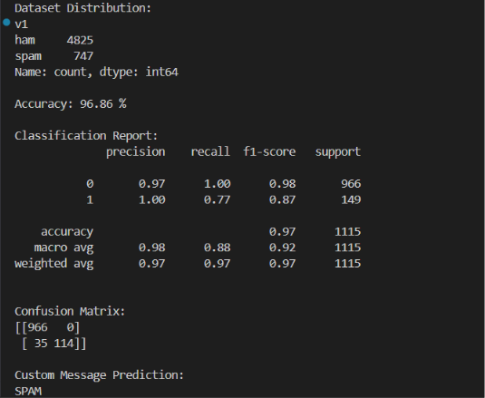

# 📧 Spam Mail Detection Using Machine Learning

## 📌 Overview

Spam emails are one of the most common cybersecurity threats, causing unwanted communication, phishing attacks, and information overload. This project develops a Machine Learning-based Spam Mail Detection System that classifies emails as Spam or Ham (Legitimate) using Natural Language Processing (NLP) techniques.

The system preprocesses email text, extracts meaningful features, trains a machine learning model, and evaluates its performance using classification metrics.

---

## 🎯 Objectives

* Automatically classify emails as Spam or Ham
* Apply Natural Language Processing (NLP) techniques
* Perform text preprocessing and feature extraction
* Train machine learning classification models
* Evaluate classification performance
* Improve email filtering and security

---

## 🛠️ Technologies Used

* Python
* Scikit-Learn
* Pandas
* NumPy
* Matplotlib
* Natural Language Processing (NLP)

---

## 📂 Dataset

The dataset contains email messages labeled as:

* Spam Emails
* Ham (Legitimate) Emails

Dataset Features:

* Email Content
* Spam/Ham Labels
* Processed Text Features

---

## 🔍 Key Features

✅ Spam Email Classification

✅ Text Preprocessing

✅ Feature Extraction

✅ Natural Language Processing

✅ Machine Learning Model Training

✅ Accuracy Evaluation

✅ Confusion Matrix Analysis

---

## 🧠 Machine Learning Workflow

### Data Preprocessing

* Text Cleaning
* Lowercase Conversion
* Stop Word Removal
* Tokenization

### Feature Engineering

* Text Vectorization
* Feature Extraction

### Model Training

A Machine Learning classification model is trained to distinguish spam emails from legitimate emails.

---

## 📊 Evaluation Metrics

The model is evaluated using:

* Accuracy Score
* Confusion Matrix
* Classification Performance Analysis

---

# 📈 Project Visualizations

## 📊 Spam vs Ham Distribution


---

## 🎯 Model Accuracy



---

## 🔥 Confusion Matrix


---

## 📈 Results

Key outcomes of the project:

✅ Successfully classified spam and legitimate emails

✅ Achieved high prediction accuracy

✅ Demonstrated effective use of NLP techniques

✅ Improved understanding of text classification models

✅ Visualized model performance using confusion matrix analysis

---

## 📁 Project Structure

```text
Spam-Mail-Detector-ML/
│
├── images/
│   ├── Accuracy.png
│   ├── Confusion Matrix.png
│   └── Spam vs Ham.png
│
├── spam.csv
├── spam_detector.py
├── Spam Mail Detector.pdf
├── Spam Mail Detector.docx
├── README.md
└── LICENSE
```

---

## 🚀 Future Enhancements

* Deep Learning-Based Spam Detection
* Real-Time Email Filtering
* Web Application Deployment
* Email Client Integration
* Multi-Language Spam Detection
* Explainable AI Techniques

---

## ▶️ Installation

Clone the repository:

```bash
git clone https://github.com/charanyadavkandhi/Spam-Mail-Detector-ML.git
```

Navigate to the project folder:

```bash
cd Spam-Mail-Detector-ML
```

Install required packages:

```bash
pip install pandas numpy scikit-learn matplotlib
```

Run the project:

```bash
python spam_detector.py
```

---

## 👨‍💻 Author

**Kandhi Charan Yadav**

🎓 B.Tech Computer Science Engineering
🏫 SR University

### Connect With Me

* GitHub: https://github.com/charanyadavkandhi
* LinkedIn: https://www.linkedin.com/in/kandhicharanyadav

---

## 📜 License

This project is licensed under the MIT License.
